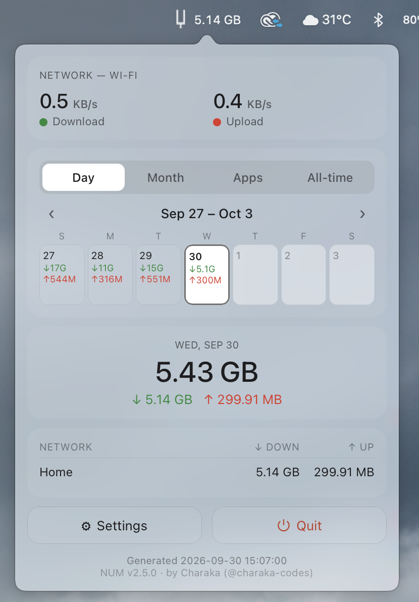
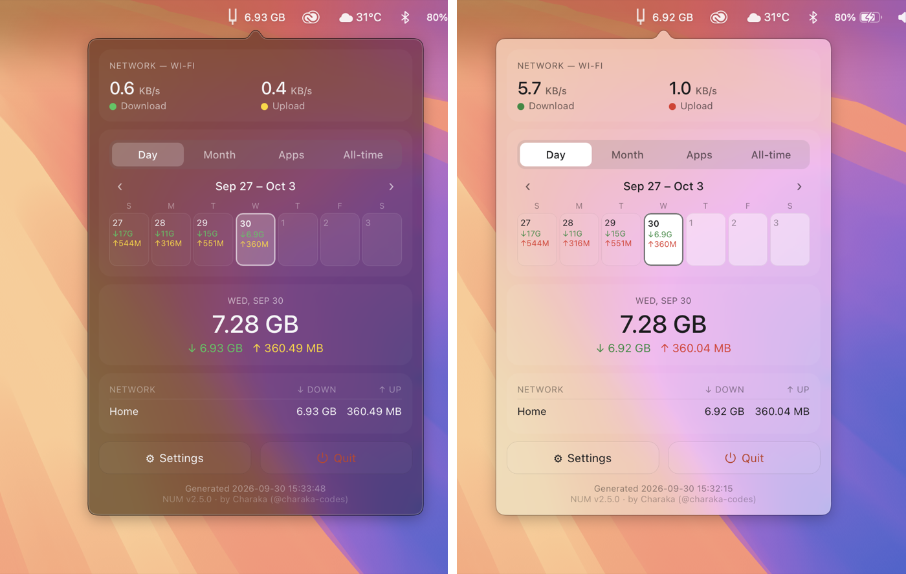
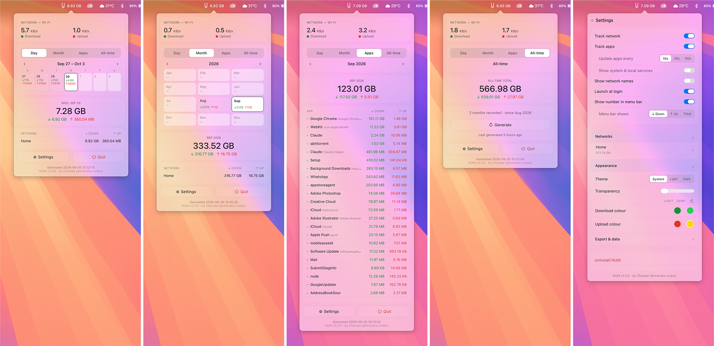

# NUM — Network Usage Monitor

A lightweight macOS **menu bar app** that tracks how much data you download
and upload, and attributes it to the network you're on — home Wi-Fi, office
Wi-Fi, mobile hotspot, ethernet — so you get a clear per-network breakdown,
plus a per-app breakdown of what's actually using that data.

A single click on the menu bar icon opens a translucent glass panel with live
speeds, a calendar, per-app usage, and an all-time total. Everything stays on
your Mac: only usage totals are stored locally, in `~/.netmonitor-v2/`. No
packet contents, no browsing history, nothing leaves your machine — the only
network request NUM ever makes is a plain check for a newer version, and only
when you explicitly click "Check for updates".



### Light and dark


### Every tab, at a glance


## Features

- **Menu bar at a glance** — today's total data usage next to the icon
  (down / up / combined, your choice), which you can hide for an icon-only
  look
- **One-click glass panel** — live download/upload speed, and four tabs:
  Day, Month, Apps, and All-time
- **Per-app breakdown** — see exactly which apps are using your data, with
  a per-network split for each one. Byte-accurate: verified against real
  traffic with 0% loss during development, not an estimate
- **Real network names** — shows your actual Wi-Fi SSID per network, so you
  can tell home from office from hotspot (needs Location permission — see
  below)
- **Day, Month & All-time views** — daily and monthly totals live; an
  all-time total is computed on demand (tap Generate) so it never has to
  rescan your whole history in the background
- **System / Light / Dark theme** — follows macOS automatically, or force
  either one
- **Flexible CSV export** — export any single month, a whole year, or your
  entire history to `~/Downloads`
- **Customisable colours** — separate download/upload colour pairs for
  light and dark theme (a colour tuned for one can be unreadable on the
  other), with a one-tap reset back to the defaults
- **Launch at login** — optional toggle to start NUM automatically
- **Pause anytime** — a tracking toggle stops/resumes recording
- **In-app Uninstall** — a real uninstall from inside Settings: unregisters
  launch-at-login correctly, clears every trace of app data, and removes
  the app itself
- Native AppKit, no Dock icon, minimal footprint

## Requirements

- macOS 13 or newer (built and tested on macOS 26)
- Python 3 from [python.org](https://www.python.org/downloads/macos/)
  (recommended over the system Python — it ships prebuilt wheels)
- Xcode command line tools for the build toolchain:
  ```bash
  xcode-select --install
  ```

## Build the app

```bash
git clone https://github.com/charaka-codes/NUM.git
cd NUM
./build.sh
```

This creates a virtualenv, installs the dependencies (pyobjc frameworks +
py2app), and produces **`dist/NUM V2.app`**.

## Make a drag-and-drop installer (DMG)

For the standard Mac experience — a `.dmg` that opens to show the app next to
an Applications folder, so you just drag one onto the other:

```bash
./make-dmg.sh
```

This packages **`NUM V2.dmg`**. Share that file with anyone; they open it and
drag NUM onto Applications. (`./release.sh` does the build and the DMG in one
step.)

## Install

Open `NUM V2.dmg` and drag **NUM** onto the Applications folder, then launch
it.

On first launch macOS may warn it's from an unidentified developer — this is
expected for an unsigned app. Right-click the app -> **Open** -> **Open**, or
allow it under System Settings -> Privacy & Security.

### Wi-Fi network names (important)

macOS treats the Wi-Fi network *name* as location data, so it hides it until
you grant Location permission. Without it, networks show as a generic "Wi-Fi".
To see real SSIDs:

System Settings -> Privacy & Security -> Location Services -> enable for **NUM**.

The permission prompt appears the first time you run the installed app.

### Launch at login

Open the panel -> **Settings** (gear) -> toggle **Launch at login**. Or add it
manually via System Settings -> General -> Login Items.

## Using NUM

- **Left-click** the menu bar icon to open the panel.
- **Day tab**: a week strip — tap any day to see its total and per-network
  breakdown. Use the arrows to move between weeks.
- **Month tab**: month tiles for the year, with a year total — tap a month to
  drill into its daily breakdown, tap again to return.
- **Apps tab**: every app that used data this month, sorted by usage — tap
  one to expand its per-network split.
- **All-time tab**: tap **Generate** for a total across your entire recorded
  history. Computed on demand rather than kept live, so it never slows down
  the panel's normal refresh.
- **Settings** (gear button): network/app tracking on/off, show/hide the
  menu bar number, launch at login, theme, transparency, download/upload
  colours (separate for light and dark, with a reset), the export tools, and
  Uninstall.
- **Export**: in Settings, choose Month / Year / All time, pick the period,
  and export a CSV to your Downloads.
- **Quit** from the button in the panel.

## Uninstall

**From inside the app (recommended):** Settings -> **Uninstall NUM**. This
correctly unregisters launch-at-login (the only way to do that correctly is
from the app's own running code), clears its cache/WebKit/preferences data,
deletes your entire `~/.netmonitor-v2/` usage-data folder, and moves the app
to the Trash. This can't be undone — if you just want to clear your history
and keep using NUM, use **Settings -> Erase all data** instead, which keeps
the app installed.

**From the command line**, `./uninstall.sh` does the same file/login-item
cleanup and asks separately whether to also delete your usage data.

Either way, one thing no app can remove: macOS keeps its own permanent record
of "apps that have used the Login Items API" in Background Task Management,
separate from any app's install state. It's harmless (nothing runs, nothing
is installed) and this is true of every app in this category, not specific
to NUM.

## Run from source (development)

```bash
pip install pyobjc-framework-Cocoa pyobjc-framework-WebKit \
  pyobjc-framework-CoreLocation pyobjc-framework-CoreWLAN \
  pyobjc-framework-ServiceManagement
python3 run.py                        # launches the menu bar app
python3 -m netmonitor.report          # this month's report in the terminal
python3 -m netmonitor.report 2026-07  # a specific month
python3 -m netmonitor.report --all    # every recorded month
```

Note: some features (single-click open, the real Wi-Fi name via Location
permission, launch-at-login) only behave correctly in the built `.app`, not
when running loose from source.

## How it works

On a short interval the app reads macOS's own interface byte counters
(`netstat -ibn`), identifies the active network (`route get default` plus the
Wi-Fi SSID via CoreWLAN / system_profiler), and writes the *delta* since the
last reading into SQLite, tagged with the network label. A separate, slower
sampler reads `nettop` for per-app attribution, diffing each process's own
counter independently and clamping against the interface total so a dropped
or reset counter can't be booked as a multi-gigabyte spike. Views and reports
group those rows by network, app, and period.

Because it measures interface throughput, totals include background and
system traffic too — which is what you want for a data-cap style report.

## Project structure

```
NUM/
├── netmonitor/            # (internal package name)
│   ├── core.py            # network detection, byte counters, aggregation
│   ├── store.py           # split-by-month SQLite storage layer
│   ├── apps.py            # per-app sampler (nettop-based)
│   ├── app.py             # native AppKit menu bar app
│   ├── popover.py         # NSPopover + WKWebView glass panel
│   ├── dashboard.py       # the panel UI (HTML/CSS/JS)
│   ├── settings.py        # persistent preferences
│   ├── updates.py         # manual "check for updates" (the app's only
│   │                       network call, user-triggered only)
│   └── report.py          # CLI report tool
├── assets/                # app icon + menu bar template
├── run.py                 # entry point
├── setup.py               # py2app build config
├── build.sh               # one-command build
├── make-dmg.sh            # build the DMG installer
├── uninstall.sh           # remove app + data (command-line path)
└── README.md
```

## License

MIT (c) Charaka (@charaka-codes)
